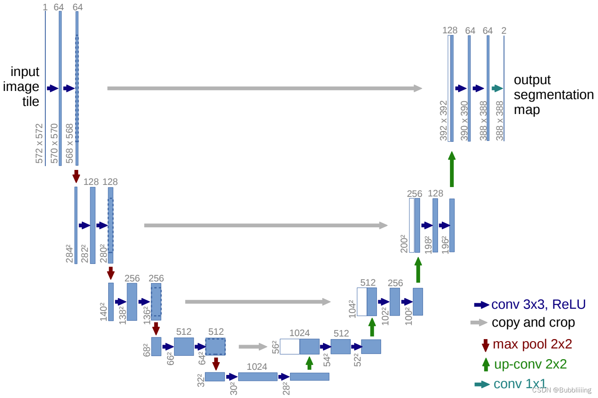

[Diffusion扩散模型学习1——Pytorch搭建DDPM实现图片生成_Bubbliiiing的博客-CSDN博客](https://blog.csdn.net/weixin_44791964/article/details/128604816)

https://mp.weixin.qq.com/s/Y_IKXXoVePy8nOCI_DbYdg

# 源码下载地址

https://github.com/bubbliiiing/ddpm-pytorch

喜欢的可以点个star噢。

# 网络构建

## 一、什么是Diffusion


如上图所示。DDPM模型主要分为两个过程：

1. Forward加噪过程（从右往左），数据集的真实图片中逐步加入高斯噪声，最终变成一个杂乱无章的高斯噪声，这个过程一般发生在训练的时候。加噪过程满足一定的数学规律。
2. Reverse去噪过程（从左往右），指对**加了噪声的图片**逐步去噪，从而还原出真实图片，这个过程一般发生在预测生成的时候。
3. 尽管在这里说的是加了噪声的图片，但实际去预测生成的时候，是随机生成一个高斯噪声来去噪。去噪的时候不断根据 $X_t$ 的图片生成 $X_{t-1}$ 的噪声，从而实现图片的还原。

### 1、加噪过程


Forward加噪过程主要符合如下的公式：
$$
x_{t}
=
\sqrt{\alpha_{t}} x_{t-1}
+
\sqrt{1-\alpha_{t}} z_{1}
$$
其中$\sqrt{\alpha_t}$ 是预先设定好的超参数，被称为Noise schedule，通常是小于1的值，在论文中 $\alpha_t$ 的值从0.9999到0.998。$\epsilon_{t-1} \sim N(0, 1)$ 是高斯噪声。由公式（1）迭代推导。

$$
x_{t}
=
\sqrt{a_{t}}
\left(\sqrt{a_{t-1}} x_{t-2}+\sqrt{1-\alpha_{t-1}} z_{2}\right)
+
\sqrt{1-\alpha_{t}} z_{1}
=
\sqrt{a_{t} a_{t-1}} x_{t-2}
+
\left(\sqrt{a_{t}\left(1-\alpha_{t-1}\right)} z_{2}
+
\sqrt{1-\alpha_{t}} z_{1}\right)
$$
其中每次加入的噪声都服从高斯分布 $z_1, z_2, \ldots \sim \mathcal{N}(0, 1)$，两个高斯分布的相加高斯分布满足公式：$\mathcal{N}\left(0, \sigma_{1}^{2}\right)+\mathcal{N}\left(0, \sigma_{2}^{2}\right) \sim \mathcal{N}\left(0,\left(\sigma_{1}^{2}+\sigma_{2}^{2}\right)\right)$ ，因此，得到 $x_t$ 的公式为

$$
x_{t}
=
\sqrt{a_{t} a_{t-1}} x_{t-2}
+
\sqrt{1-\alpha_{t} \alpha_{t-1}} z_{2}
$$
因此不断往里面套，就能发现规律了，其实就是累乘
可以直接得出 $x_0$ 到 $x_t$ 的公式：
$$
x_t
=
\sqrt {\overline{\alpha_t}}x_0
+
\sqrt {1 - \overline{\alpha_t}}z_t
$$
其中 $\overline {\alpha_t} =  {\textstyle \prod_{i}^{t}} \alpha_i$，这是随Noise schedule设定好的超参数，$z_{t-1} \sim N(0, 1)$ 也是一个高斯噪声。通过上述两个公式，我们可以不断的将图片进行破坏加噪。

### 2、去噪过程


反向过程就是通过估测噪声，多次迭代逐渐将被破坏的 $x_t$ 恢复成 $x_0$ ，在恢复时刻，我们已经知道的是 $x_t$，这是图片在 $t$ 时刻的噪声图。一下子从 $x_t$ 恢复成 $x_0$ 是不可能的，们只能一步一步的往前推，首先从 $x_t$ 恢复成 $x_{t-1}$。根据贝叶斯公式，已知 $x_t$ 反推 $x_{t-1}$：
$$
q\left(x_{t-1} \mid x_{t}, x_{0}\right)
=
q\left(x_{t} \mid x_{t-1}, x_{0}\right)
\frac
{q\left(x_{t-1} \mid x_{0}\right)}
{q\left(x_{t} \mid x_{0}\right)}
$$
右边的三个东西都可以从 $x_0$ 开始推得到：
$$
q\left(x_{t-1} \mid x_{0}\right)
=
\sqrt{\bar{a}_{t-1}} x_{0}
+
\sqrt{1-\bar{a}_{t-1}} z \sim \mathcal{N}\left(\sqrt{\bar{a}_{t-1}} x_{0}, 1-\bar{a}_{t-1}\right)
$$

$$
q\left(x_{t} \mid x_{0}\right)
=
\sqrt{\bar{a}_{t}} x_{0}
+
\sqrt{1-\bar{\alpha}_{t}} z \sim \mathcal{N}\left(\sqrt{\bar{a}_{t}} x_{0}, 1-\bar{\alpha}_{t}\right)
$$

$$
q\left(x_{t} \mid x_{t-1}, x_{0}\right)
=
\sqrt{a_{t}} x_{t-1}
+
\sqrt{1-\alpha_{t}} z \sim \mathcal{N}\left(\sqrt{a_{t}} x_{t-1}, 1-\alpha_{t}\right)
$$

因此，由于右边三个东西均满足正态分布，$q\left(x_{t-1} \mid x_t, x_0\right)$ 满足分布如下：
$$
\propto
\exp
\left(
-\frac{1}{2}
\left(
\frac
{\left(x_{t}-\sqrt{\alpha_{t}} x_{t-1}\right)^{2}} {\beta_{t}}
+
\frac{
\left(x_{t-1}-\sqrt{\bar{\alpha}_{t-1}} x_{0}\right)^{2}}
{1-\bar{\alpha}_{t-1}}
-
\frac
{\left(x_{t}-\sqrt{\bar{\alpha}_{t}} x_{0}\right)^{2}}
{1-\bar{\alpha}_{t}}
\right)
\right)
$$
把标准正态分布展开后，乘法就相当于加，除法就相当于减，把他们汇总
接下来继续化简，咱们现在要求的是上一时刻的分布
$$
\begin{aligned}
& \propto \exp \left(-\frac{1}{2}\left(\frac{\left(x_t-\sqrt{\alpha_t} x_{t-1}\right)^2}{\beta_t}+\frac{\left(x_{t-1}-\sqrt{\bar{\alpha}_{t-1}} x_0\right)^2}{1-\bar{\alpha}_{t-1}}-\frac{\left(x_t-\sqrt{\bar{\alpha}_t} x_0\right)^2}{1-\bar{\alpha}_t}\right)\right) \\
& =\exp \left(-\frac{1}{2}\left(\frac{x_t^2-2 \sqrt{\alpha_t} x_t x_{t-1}+\alpha_t x_{t-1}^2}{\beta_t}+\frac{x_{t-1}^2-2 \sqrt{\bar{\alpha}_{t-1}} x_0 x_{t-1}+\bar{\alpha}_{t-1} x_0^2}{1-\bar{\alpha}_{t-1}}-\frac{\left(x_t-\sqrt{\bar{\alpha}_t} x_0\right)^2}{1-\bar{\alpha}_t}\right)\right) \\
& =\exp \left(-\frac{1}{2}\left(\left(\frac{\alpha_t}{\beta_t}+\frac{1}{1-\bar{\alpha}_{t-1}}\right) x_{t-1}^2-\left(\frac{2 \sqrt{\alpha_t}}{\beta_t} x_t+\frac{2 \sqrt{\bar{\alpha}_{t-1}}}{1-\bar{\alpha}_{t-1}} x_0\right) x_{t-1}+C\left(x_t, x_0\right)\right)\right)
\end{aligned}
$$
正态分布满足公式， $\exp \left(-\frac{(x-\mu)^2}{2 \sigma^2}\right)=\exp \left(-\frac{1}{2}\left(\frac{1}{\sigma^2} x^2-\frac{2 \mu}{\sigma^2} x+\frac{\mu^2}{\sigma^2}\right)\right)$，其中 $\sigma$ 就是方差，$\mu$ 就是均值，配方后我们就可以获得均值和方差。

此时的均值为：$\tilde{\mu}_t\left(x_t, x_0\right)=\frac{\sqrt{\alpha_t}\left(1-\bar{\alpha}_{t-1}\right)}{1-\bar{\alpha}_t} x_t+\frac{\sqrt{\bar{\alpha} t-1} \beta_t}{1-\bar{\alpha}_t} x_0$ 。根据之前的公式，$x_t=\sqrt {\overline{\alpha_t}}x_0+\sqrt {1 - \overline{\alpha_t}}z_t$，我们可以使用 $x_t$ 反向估计 $x_0$ 得到 $x_0$ 满足分布 $x_0=\frac{1}{\sqrt{\bar{\alpha} t}}\left(\mathrm{x}_t-\sqrt{1-\bar{\alpha}_t} z_t\right)$ 。最终得到均值为 $\tilde{\mu}_t=\frac{1}{\sqrt{a t}}\left(x_t-\frac{\beta_t}{\sqrt{1-\bar{a}_t}} z_t\right)$ ，$z_t$ 代表 $t$ 时刻的噪音是什么。由 $z_t$ 无法直接获得，网络便通过当前时刻的 $x_t$ 经过神经网络计算 $z_t$ 。$\epsilon_\theta\left(x_t, t\right)$也就是上面提到的 $z_t$。$\epsilon_\theta$ 代表神经网络。
$$
x_{t-1}
=
\frac{1}{\sqrt{\alpha_t}}
\left(x_t-\frac{1-\alpha_t}{\sqrt{1-\bar{\alpha}_t}} \epsilon_\theta\left(x_t, t\right)\right)
+
\sigma_t z
$$
由于加噪过程中的真实噪声 $\epsilon$ 在复原过程中是无法获得的，因此DDPM的关键就是训练一个由 $x_t$ 和 $t$ 估测橾声的模型$\epsilon_\theta\left(x_t, t\right)$ ，其中 $\theta$ 就是模型的训练参数，$\sigma_t$ 也是一个高斯噪声 $\sigma_t \sim N(0,1)$，用于表示估测与实际的差距。在DDPM中，使用U-Net作为估测噪声的模型。

本质上，我们就是训练这个Unet模型，该模型输入为 $x_t$ 和 $t$ ，输出为 $x_t$ 时刻的高斯噪声。即利用 $x_t$ 和 $t$ 预测这一时刻的高斯噪声。**这样就可以一步一步的再从噪声回到真实图像。**

## 二、DDPM网络的构建（Unet网络的构建）



上图是典型的Unet模型结构，仅仅作为示意图，里面具体的数字同学们无需在意，和本文的学习无关。在本文中，Unet的输入和输出shape相同，通道均为3（一般为RGB三通道），宽高相同。

本质上，DDPM最重要的工作就是训练Unet模型，该模型输入为 $x_t$ 和 $t$，输出为 $x_{t-1}$ 时刻的高斯噪声。即利用 $x_t$ 和 $t$ 预测上一时刻的高斯噪声。这样就可以一步一步的再从噪声回到真实图像。

假设我们需要生成一个[64, 64, 3]的图像，在 $t$ 时刻，我们有一个 $x_t$ 噪声图，该噪声图的的shape也为[64, 64, 3]，我们将它和 $t$ 一起输入到Unet中。Unet的输出为 $x_{t-1}$ 时刻的[64, 64, 3]的噪声。

实现代码如下，代码中的特征提取模块为残差结构，方便优化：

```python
import math

import torch
import torch.nn as nn
import torch.nn.functional as F


def get_norm(norm, num_channels, num_groups):
    if norm == "in":
        return nn.InstanceNorm2d(num_channels, affine=True)
    elif norm == "bn":
        return nn.BatchNorm2d(num_channels)
    elif norm == "gn":
        return nn.GroupNorm(num_groups, num_channels)
    elif norm is None:
        return nn.Identity()
    else:
        raise ValueError("unknown normalization type")
    
#------------------------------------------#
#   计算时间步长的位置嵌入。
#   一半为sin，一半为cos。
#------------------------------------------#
class PositionalEmbedding(nn.Module):
    def __init__(self, dim, scale=1.0):
        super().__init__()
        assert dim % 2 == 0
        self.dim = dim
        self.scale = scale

    def forward(self, x):
        device      = x.device
        half_dim    = self.dim // 2
        emb = math.log(10000) / half_dim
        emb = torch.exp(torch.arange(half_dim, device=device) * -emb)
        # x * self.scale和emb外积
        emb = torch.outer(x * self.scale, emb)
        emb = torch.cat((emb.sin(), emb.cos()), dim=-1)
        return emb

#------------------------------------------#
#   下采样层，一个步长为2x2的卷积
#------------------------------------------#
class Downsample(nn.Module):
    def __init__(self, in_channels):
        super().__init__()

        self.downsample = nn.Conv2d(in_channels, in_channels, 3, stride=2, padding=1)
    
    def forward(self, x, time_emb, y):
        if x.shape[2] % 2 == 1:
            raise ValueError("downsampling tensor height should be even")
        if x.shape[3] % 2 == 1:
            raise ValueError("downsampling tensor width should be even")

        return self.downsample(x)

#------------------------------------------#
#   上采样层，Upsample+卷积
#------------------------------------------#
class Upsample(nn.Module):
    def __init__(self, in_channels):
        super().__init__()
        self.upsample = nn.Sequential(
            nn.Upsample(scale_factor=2, mode="nearest"),
            nn.Conv2d(in_channels, in_channels, 3, padding=1),
        )
        
    def forward(self, x, time_emb, y):
        return self.upsample(x)

#------------------------------------------#
#   使用Self-Attention注意力机制
#   做一个全局的Self-Attention
#------------------------------------------#
class AttentionBlock(nn.Module):
    def __init__(self, in_channels, norm="gn", num_groups=32):
        super().__init__()
        
        self.in_channels = in_channels
        self.norm = get_norm(norm, in_channels, num_groups)
        self.to_qkv = nn.Conv2d(in_channels, in_channels * 3, 1)
        self.to_out = nn.Conv2d(in_channels, in_channels, 1)

    def forward(self, x):
        b, c, h, w  = x.shape
        q, k, v     = torch.split(self.to_qkv(self.norm(x)), self.in_channels, dim=1)

        q = q.permute(0, 2, 3, 1).view(b, h * w, c)
        k = k.view(b, c, h * w)
        v = v.permute(0, 2, 3, 1).view(b, h * w, c)

        dot_products = torch.bmm(q, k) * (c ** (-0.5))
        assert dot_products.shape == (b, h * w, h * w)

        attention   = torch.softmax(dot_products, dim=-1)
        out         = torch.bmm(attention, v)
        assert out.shape == (b, h * w, c)
        out         = out.view(b, h, w, c).permute(0, 3, 1, 2)

        return self.to_out(out) + x
    
#------------------------------------------#
#   用于特征提取的残差结构
#------------------------------------------#
class ResidualBlock(nn.Module):
    def __init__(
        self, in_channels, out_channels, dropout, time_emb_dim=None, num_classes=None, activation=F.relu,
        norm="gn", num_groups=32, use_attention=False,
    ):
        super().__init__()

        self.activation = activation

        self.norm_1 = get_norm(norm, in_channels, num_groups)
        self.conv_1 = nn.Conv2d(in_channels, out_channels, 3, padding=1)

        self.norm_2 = get_norm(norm, out_channels, num_groups)
        self.conv_2 = nn.Sequential(
            nn.Dropout(p=dropout), 
            nn.Conv2d(out_channels, out_channels, 3, padding=1),
        )

        self.time_bias  = nn.Linear(time_emb_dim, out_channels) if time_emb_dim is not None else None
        self.class_bias = nn.Embedding(num_classes, out_channels) if num_classes is not None else None

        self.residual_connection    = nn.Conv2d(in_channels, out_channels, 1) if in_channels != out_channels else nn.Identity()
        self.attention              = nn.Identity() if not use_attention else AttentionBlock(out_channels, norm, num_groups)
    
    def forward(self, x, time_emb=None, y=None):
        out = self.activation(self.norm_1(x))
        # 第一个卷积
        out = self.conv_1(out)
        
        # 对时间time_emb做一个全连接，施加在通道上
        if self.time_bias is not None:
            if time_emb is None:
                raise ValueError("time conditioning was specified but time_emb is not passed")
            out += self.time_bias(self.activation(time_emb))[:, :, None, None]

        # 对种类y_emb做一个全连接，施加在通道上
        if self.class_bias is not None:
            if y is None:
                raise ValueError("class conditioning was specified but y is not passed")

            out += self.class_bias(y)[:, :, None, None]

        out = self.activation(self.norm_2(out))
        # 第二个卷积+残差边
        out = self.conv_2(out) + self.residual_connection(x)
        # 最后做个Attention
        out = self.attention(out)
        return out

#------------------------------------------#
#   Unet模型
#------------------------------------------#
class UNet(nn.Module):
    def __init__(
        self, img_channels, base_channels=128, channel_mults=(1, 2, 2, 2),
        num_res_blocks=2, time_emb_dim=128 * 4, time_emb_scale=1.0, num_classes=None, activation=F.silu,
        dropout=0.1, attention_resolutions=(1,), norm="gn", num_groups=32, initial_pad=0,
    ):
        super().__init__()
        # 使用到的激活函数，一般为SILU
        self.activation = activation
        # 是否对输入进行padding
        self.initial_pad = initial_pad
        # 需要去区分的类别数
        self.num_classes = num_classes
        
        # 对时间轴输入的全连接层
        self.time_mlp = nn.Sequential(
            PositionalEmbedding(base_channels, time_emb_scale),
            nn.Linear(base_channels, time_emb_dim),
            nn.SiLU(),
            nn.Linear(time_emb_dim, time_emb_dim),
        ) if time_emb_dim is not None else None
    
        # 对输入图片的第一个卷积
        self.init_conv  = nn.Conv2d(img_channels, base_channels, 3, padding=1)

        # self.downs用于存储下采样用到的层，首先利用ResidualBlock提取特征
        # 然后利用Downsample降低特征图的高宽
        self.downs      = nn.ModuleList()
        self.ups        = nn.ModuleList()
        
        # channels指的是每一个模块处理后的通道数
        # now_channels是一个中间变量，代表中间的通道数
        channels        = [base_channels]
        now_channels    = base_channels
        for i, mult in enumerate(channel_mults):
            out_channels = base_channels * mult
            for _ in range(num_res_blocks):
                self.downs.append(
                    ResidualBlock(
                        now_channels, out_channels, dropout,
                        time_emb_dim=time_emb_dim, num_classes=num_classes, activation=activation,
                        norm=norm, num_groups=num_groups, use_attention=i in attention_resolutions,
                    )
                )
                now_channels = out_channels
                channels.append(now_channels)
            
            if i != len(channel_mults) - 1:
                self.downs.append(Downsample(now_channels))
                channels.append(now_channels)

        # 可以看作是特征整合，中间的一个特征提取模块
        self.mid = nn.ModuleList(
            [
                ResidualBlock(
                    now_channels, now_channels, dropout,
                    time_emb_dim=time_emb_dim, num_classes=num_classes, activation=activation,
                    norm=norm, num_groups=num_groups, use_attention=True,
                ),
                ResidualBlock(
                    now_channels, now_channels, dropout,
                    time_emb_dim=time_emb_dim, num_classes=num_classes, activation=activation, 
                    norm=norm, num_groups=num_groups, use_attention=False,
                ),
            ]
        )

        # 进行上采样，进行特征融合
        for i, mult in reversed(list(enumerate(channel_mults))):
            out_channels = base_channels * mult

            for _ in range(num_res_blocks + 1):
                self.ups.append(ResidualBlock(
                    channels.pop() + now_channels, out_channels, dropout, 
                    time_emb_dim=time_emb_dim, num_classes=num_classes, activation=activation, 
                    norm=norm, num_groups=num_groups, use_attention=i in attention_resolutions,
                ))
                now_channels = out_channels
            
            if i != 0:
                self.ups.append(Upsample(now_channels))
        
        assert len(channels) == 0
        
        self.out_norm = get_norm(norm, base_channels, num_groups)
        self.out_conv = nn.Conv2d(base_channels, img_channels, 3, padding=1)
    
    def forward(self, x, time=None, y=None):
        # 是否对输入进行padding
        ip = self.initial_pad
        if ip != 0:
            x = F.pad(x, (ip,) * 4)

        # 对时间轴输入的全连接层
        if self.time_mlp is not None:
            if time is None:
                raise ValueError("time conditioning was specified but tim is not passed")
            time_emb = self.time_mlp(time)
        else:
            time_emb = None
        
        if self.num_classes is not None and y is None:
            raise ValueError("class conditioning was specified but y is not passed")
        
        # 对输入图片的第一个卷积
        x = self.init_conv(x)

        # skips用于存放下采样的中间层
        skips = [x]
        for layer in self.downs:
            x = layer(x, time_emb, y)
            skips.append(x)
        
        # 特征整合与提取
        for layer in self.mid:
            x = layer(x, time_emb, y)
        
        # 上采样并进行特征融合
        for layer in self.ups:
            if isinstance(layer, ResidualBlock):
                x = torch.cat([x, skips.pop()], dim=1)
            x = layer(x, time_emb, y)

        # 上采样并进行特征融合
        x = self.activation(self.out_norm(x))
        x = self.out_conv(x)
        
        if self.initial_pad != 0:
            return x[:, :, ip:-ip, ip:-ip]
        else:
            return x
```

## 三、Diffusion的训练思路

Diffusion的训练思路比较简单，首先随机给每个batch里每张图片都生成一个t，代表我选择这个batch里面第t个时刻的噪声进行拟合。代码如下：

```python
t = torch.randint(0, self.num_timesteps, (b,), device=device)
```

生成batch_size个噪声，计算施加这个噪声后模型在t个时刻的噪声图片是怎么样的，如下所示：

```python
def perturb_x(self, x, t, noise):
    return (
        extract(self.sqrt_alphas_cumprod, t,  x.shape) * x +
        extract(self.sqrt_one_minus_alphas_cumprod, t, x.shape) * noise
    )   

def get_losses(self, x, t, y):
    # x, noise [batch_size, 3, 64, 64]
    noise           = torch.randn_like(x)

    perturbed_x     = self.perturb_x(x, t, noise)
```

之后利用这个噪声图片、t和网络模型计算预测噪声，利用预测噪声和实际噪声进行拟合。

```python
def get_losses(self, x, t, y):
    # x, noise [batch_size, 3, 64, 64]
    noise           = torch.randn_like(x)

    perturbed_x     = self.perturb_x(x, t, noise)
    estimated_noise = self.model(perturbed_x, t, y)

    if self.loss_type == "l1":
        loss = F.l1_loss(estimated_noise, noise)
    elif self.loss_type == "l2":
        loss = F.mse_loss(estimated_noise, noise)
    return loss
```

